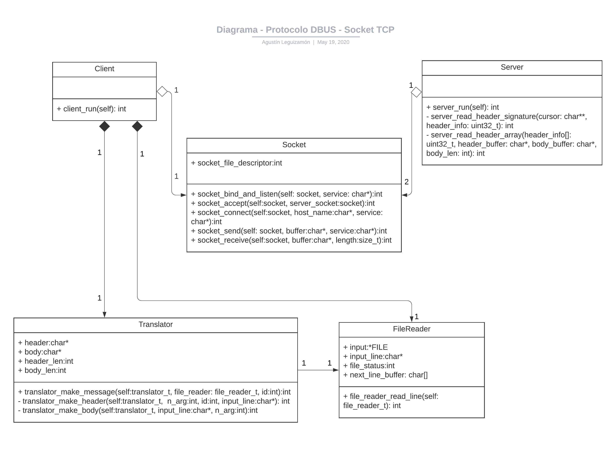

# Trabajo práctico Nro 1
## Protocolo DBUS

Estudiante: Agustin Manuel Leguizamón

Padrón: 99535

Link Github: https://github.com/AgustinLeguizamon/tp1


### Introducción:
A continuación se da una breve descripción de los TDAs que componen la implementación del protocolo dbus para la comunicación cliente/servidor a través de sockets TCP en lenguaje C.


Figura 1 - Relación entre los TDAs

A pesar de que C no tiene clases, el estilo UML del diagrama de clases se utiliza para representar la interacción entre los distintos TDA.

#### Socket

TDA socket está encargada de todo lo relacionado al canal de comunicación TCP y esto incluye, la creación de los sockets(acep, server, cliente), el establecimiento del canal, envío y recepción de datos y el cierre del canal con la correspondiente liberación de recursos.

Tanto **client** como **server** utilizan sockets (uno y dos respectivamente y para este trabajo) para poder establecer un canal de comunicación. El TDA **socket** posee la función `socket_bind_and_listen` que recibe al `acep_socket` y le asigna la dirección que recibe por parámetro fijando un límite a las conexiones que están en espera, desde ese momento el socket está listo para recibir conexiones. La función `socket_accept` recibe a los dos sockets del **server**(acep_socket, server_socket) y con la dirección dada por `acep_socket` se crea un nuevo "file descriptor" que se asigna al `server_socket` para aceptar una conexión.
De parte del cliente está la función `socket_connect` que recibe al `client_socket`, la IP y la dirección antes mencionada. Utilizando la función `getaddrinfo` obtenemos una lista de direcciones que se itera hasta lograr una conexión con aquella que tenga un socket abierto.

#### Client

Crea al lector de archivos (**fileReader**) y al socket asociado (**client_socket**) y levanta un canal de comunicación con `socket_connect`, la función `client_run` se encarga de obtener una línea de texto que se pasa a la función `translator_dbus` para aplicar el protocolo DBUS y luego enviarla al **server** a través del canal de comunicación, recibe la respuesta del servidor y la imprime en pantalla con `_client_show`.

En el primer `socket_send` se envía el "header" del mensaje y luego en el segundo el cuerpo.

#### Translator

**translator** se encarga aplicar el protocolo a la línea de texto dada por **fileReader**.
`translator_make_message` es llamada por **client** para ejecutar esta tarea. Primero `_translator_separator_`separar la línea de texto en cada parámetro (destino, ruta, interfaz) luego el método y los argumentos se terminan de separar con `_translator_method_separator` y `_translator_arg_separator`, todos son almacenados en un array de strings. Luego `_translator_make_header` se encarga de armar la cabecera del mensaje y `_translator_make_body` el cuerpo. Una vez armado se tiene el struct translator_t con todos la información necesaria para enviar el mensaje.


#### Server

El TDA **server** recibe los mensajes a través del **socket**, primero hace un `recive` de los 16 primero bytes de manera de obtener el largo del cuerpo, el id y el largo del array. Luego lee el resto del header con un `recieve` fijando el largo al del array obtenido en el primer `recieve` y por último un `recieve` para el cuerpo del mensaje.


#### Comentarios sobre Protocolo DBUS
Para el armado del mensaje plantee primero calcular el largo de todos los parámetros con su padding incluido y asignar un array en el heap del tamaño igual a la suma de los largos. Luego recorro el array con un cursor agregando byte a byte los distintos parámetros, como se puede ver en las funciones con `_append_` incluido. Por ejemplo:
```
int _translator_append_path(char** cursor, char* word){
	**cursor = 1;
	(*cursor)++;
	**cursor = 1;
	(*cursor)++;
	**cursor = 'o';
	(*cursor)++;
	**cursor = 0;
	(*cursor)++;

	*((uint32_t*)(*cursor)) = _translator_value_to_little_endian(strlen(word));
	(*cursor) += 4;

	int path_with_padding = _translator_round_up(strlen(word)+1);
	for (int i = 0; i < path_with_padding; ++i){
		**cursor = word[i];
		(*cursor)++;
	}

	return 0;
  ```
Luego la siguiente función tipo `_append_` sigue utiliza el  cursor para seguir agregando mas parametros tipo BYTE o tipo UINT32. Así hasta completar el header.

En el lado del **server** con la misma lógica se recorre la tira de bytes con un cursor y se detiene hasta encontrar un tipo de parámetro (1 para ruta del objeto, 6 para string, etc) y desde ahí empieza a leer para obtener el string, esto se realiza en la función `_server_read_option(cursor, array_info[])`.

```
char** _server_read_option(char** cursor, char input_string[]){
	uint32_t option_len;

	(*cursor) += sizeof(uint32_t); //cursor apunta a long
	option_len = *((uint32_t*) (*cursor));

	(*cursor) += sizeof(uint32_t); //cursor apunta array
	for (int i = 0; i < option_len+1; ++i){
		input_string[i]=(**cursor);
		(*cursor)++;
	}

	return cursor;
}
```

#### Comentarios de la entrega

1) El almacenamiento de los parámetros es en arreglos estáticos
por lo que en mucho casos se utiliza más memoria de lo necesario.

2) Para la implementación propuesta del protocolo se utilizaron solo tipos BYTE y UINT32, formando cada parámetro del array con solo esos dos tipos de datos. Para el momento de esta entrega no fue considerado el uso de STRUCTS para formar cada parámetro.


